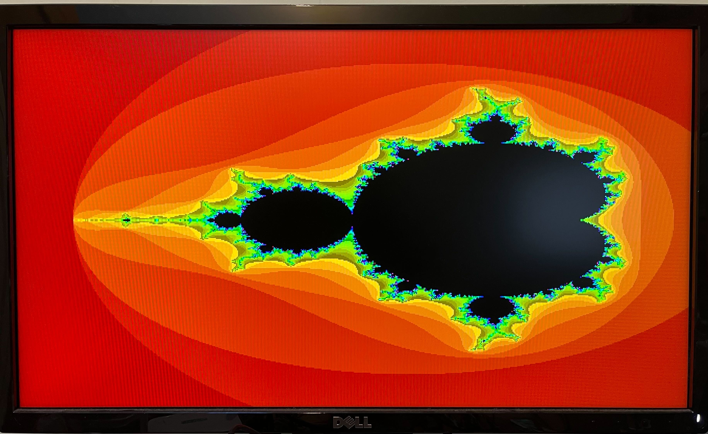

# DVI for HSTX <!-- omit in toc -->

This repository is home to the Pimoroni PicoGraphics compatible DVI driver for RP2 chips with HSTX (e.g. RP2350).

- [Introduction](#introduction)
- [Download MicroPython](#download-micropython)
- [Documentation](#documentation)
- [C/C++ Resources](#cc-resources)
- [C/C++ Community Projects](#cc-community-projects)

## Introduction

DV HSTX will enable you to create big, bold audio visual projects using MicroPython and an HDMI display of your choice.

## Download MicroPython

TODO

* [DV HSTX MicroPython Releases](https://github.com/MichaelBell/dvhstx/releases)

## Documentation

Wire up your DVI breakout as follows:

    GPIO 12 - CK-
    GPIO 13 - CK+
    GPIO 14 - D0-
    GPIO 15 - D0+
    GPIO 16 - D1-
    GPIO 17 - D1+
    GPIO 18 - D2-
    GPIO 19 - D2+

If using jumper jerky, twist the - and + wires for each signal together to help with signal integrity.

Other pinouts can be used by passing a `pinout` parameter to the `init`
function.
This pinout consists of 4 numbers giving the *positive* pin in each differential pair, in the order CK, D0, D1, D2, D3, using GPIO numbering.
The default pinout is written `{13, 15, 17, 19}`.
Only pin numbers from 12 to 20 are valid, as other pins are not connected to the HSTX peripheral.
Using invalid pin numbers is an undignosed error.

TODO

## C/C++ Resources

* :link: [C++ Boilerplate](https://github.com/MichaelBell/dvhstx-boilerplate/)

## C/C++ Community Projects

TODO
